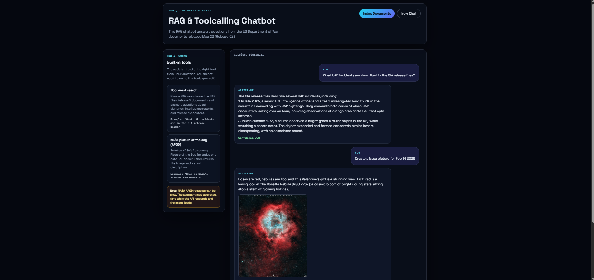
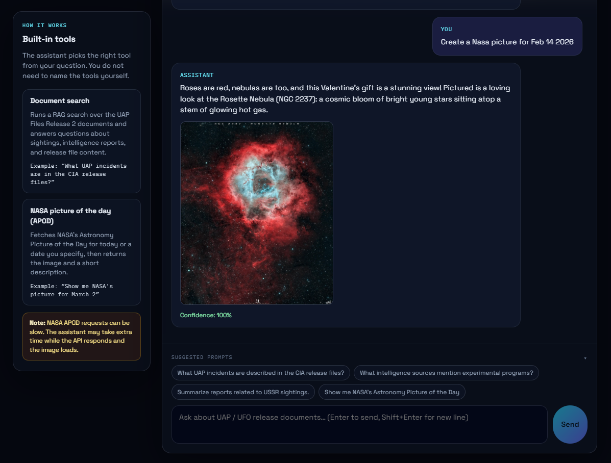

# UAP Release Files Chatbot

A Spring Boot + Spring AI chatbot with a React UI that answers questions about **UAP/UFO Release 02** documents using RAG, and can fetch **NASA Astronomy Picture of the Day (APOD)** through tool calling.





## Features

- **RAG document search** — indexes PDFs from `src/main/resources/uapDocuments` into PostgreSQL/pgvector and retrieves relevant chunks at query time
- **Tool calling** — the model chooses the right tool based on the user question
- **NASA APOD tool** — returns an astronomy image and description for today or a specific date
- **Chat memory** — conversation history stored in JDBC (user/assistant text only; tool internals are not persisted)
- **React chat UI** — dark-themed interface with left-side tool instructions, suggested prompts, confidence scores, and APOD image display
- **Docker deployment** — single container serves the API and built React frontend on port `8080`

## Built-in Tools

| Tool | Purpose | Example prompt |
|------|---------|----------------|
| `searchUapReleaseDocuments` | RAG search over UAP Files Release 2 documents | *"What UAP incidents are described in the CIA release files?"* |
| `getNasaApod` | NASA Astronomy Picture of the Day for today or a given date | *"Show me NASA's picture for March 2"* |

NASA APOD requests can be **slow** because the assistant makes multiple LLM round-trips and the image loads from NASA's servers.

## Tech Stack

| Layer | Technology |
|-------|------------|
| Backend | Spring Boot 4.0.6, Spring AI 2.0.0-M8 |
| LLM / Embeddings | OpenAI `gpt-4o-mini`, `text-embedding-3-small` |
| Vector store | PostgreSQL 16 + pgvector |
| Chat memory | Spring AI JDBC chat memory |
| Frontend | React 19, Vite |
| Deployment | Docker Compose |

## Prerequisites

- Java 17+
- Node.js 20+ (for local frontend development)
- Docker Desktop (for Postgres and full-stack Docker deployment)
- API keys:
  - `OPENAI_API_KEY` (required)
  - `NASA_API_KEY` (optional; defaults to `DEMO_KEY` in Docker)

## Quick Start (Local Development)

### 1. Configure environment variables

Create a `.env` file in the project root:

```properties
OPENAI_API_KEY=your-openai-api-key
NASA_API_KEY=your-nasa-api-key
```

### 2. Start PostgreSQL

With Docker Compose (recommended for local dev):

```bash
docker compose up -d postgres
```

Spring Boot Docker Compose support can also start Postgres automatically when running with the `dev` profile.

### 3. Run the backend

```bash
./mvnw spring-boot:run
```

The API starts on `http://localhost:8080`.

### 4. Run the frontend (optional during development)

```bash
cd frontend
npm install
npm run dev
```

Vite proxies API calls to the Spring Boot backend.

### 5. Index documents

Click **Index Documents** in the UI, or call:

```bash
curl http://localhost:8080/loadFiles
```

Documents are read from `classpath:uapDocuments/**/*`, split into chunks, embedded, and stored in pgvector.

## Docker Deployment (Full Stack)

Build and run the app and database together:

```bash
docker compose up --build
```

Open `http://localhost:8080` in your browser.

Environment variables are read from your shell or a `.env` file:

```properties
OPENAI_API_KEY=your-openai-api-key
NASA_API_KEY=your-nasa-api-key
```

## API Endpoints

| Method | Path | Description |
|--------|------|-------------|
| `POST` | `/chat` | Send a chat message |
| `GET` | `/loadFiles` | Load and embed UAP documents into the vector store |

### Chat request

```json
{
  "chatId": "optional-conversation-id",
  "question": "What UAP incidents are in the release files?"
}
```

### Chat response

```json
{
  "message": "Assistant reply text",
  "confidence": 0.85,
  "imageUrl": "https://apod.nasa.gov/..."
}
```

## Project Structure

```text
uapReleaseFilesChatbot/
├── frontend/                 # React + Vite UI
├── src/main/java/            # Spring Boot application
│   └── .../config/           # ChatClient, tools, system prompt
│   └── .../service/          # Chat, document search, NASA APOD
│   └── .../controller/       # REST endpoints
├── src/main/resources/
│   └── uapDocuments/         # Source PDFs for RAG indexing
├── docs/images/              # README screenshots
├── compose.yaml              # Docker Compose (app + postgres)
├── Dockerfile                # Multi-stage build (frontend + backend)
└── README.md
```

## Configuration

Key settings are in:

- `src/main/resources/application-dev.yml` — local development
- `src/main/resources/application-docker.yml` — Docker profile
- `src/main/resources/application.properties` — imports `.env`

| Property | Description |
|----------|-------------|
| `spring.ai.openai.api-key` | OpenAI API key |
| `nasa.api-key` | NASA API key for APOD |
| `spring.ai.vectorstore.pgvector.*` | pgvector configuration |
| `spring.ai.chat.memory.repository.jdbc.*` | JDBC chat memory schema |

## UI Overview

- **Header** — title, document indexing, and new chat actions
- **Left sidebar** — explains the two built-in tools and APOD latency note
- **Chat panel** — scrollable message history, suggested prompts, and input composer
- **Session** — `chatId` stored in browser `sessionStorage` for multi-turn conversations

## License

Educational / demonstration project.
