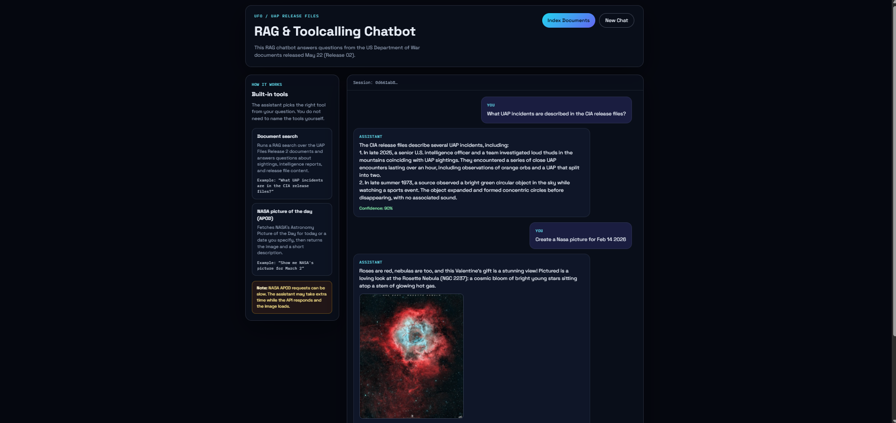
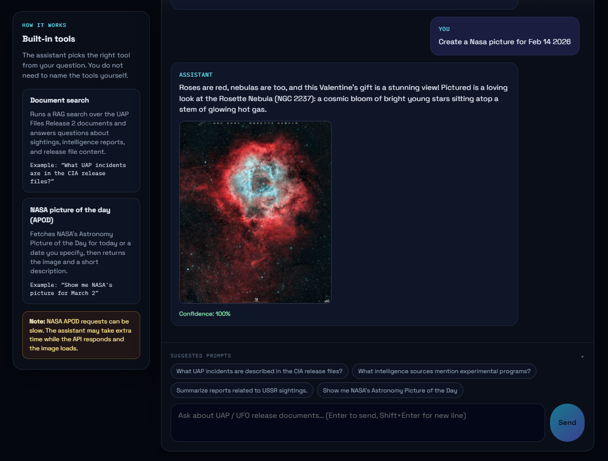

# UAP Release Files Chatbot

A Spring Boot + Spring AI portfolio project with a React UI that answers questions about **UAP/UFO Release 02** documents using RAG, and fetches **NASA Astronomy Picture of the Day (APOD)** through tool calling.

**Live demo:** [https://uapreleasefileschatbot.onrender.com/](https://uapreleasefileschatbot.onrender.com/)

**Built by:** John Pranoy Yalla — Software Engineer / Full Stack Developer (6+ years)  
[LinkedIn](https://www.linkedin.com/in/johnpranoy7/) · [GitHub](https://github.com/johnpranoy7) · [Email](mailto:johnpranoy7@gmail.com) · [Resume](https://uapreleasefileschatbot.onrender.com/resume.pdf)




## Features

- **RAG document search** — indexes PDFs from `src/main/resources/uapDocuments` into PostgreSQL/pgvector and retrieves relevant chunks at query time
- **Tool calling** — Spring AI picks the right tool from the user's question (no keyword-based intent routing)
- **NASA APOD tool** — returns an astronomy image and description for today or a resolved date (including relative dates like *"February 14, two years before the current year"*), powered by the [NASA APOD API](https://github.com/nasa/apod-api)
- **Chat memory** — conversation history stored in JDBC (user/assistant text only; tool internals are not persisted)
- **Idempotent indexing** — `/loadFiles` only embeds documents when the vector store is empty
- **Chat memory cleanup** — scheduled job removes chat memory records older than 2 days
- **React chat UI** — dark-themed portfolio interface with recruiter/developer sidebar tabs, suggested prompts, confidence scores, and APOD image display
- **Docker deployment** — single container serves the API and built React frontend

## Built-in Tools

| Tool | Purpose | Example prompt |
|------|---------|----------------|
| `searchUapReleaseDocuments` | RAG search over UAP Files Release 2 documents | *"What UAP incidents are described in the CIA release files?"* |
| `getNasaApod` | NASA APOD for today or a resolved date | *"Show me NASA's picture of the day for February 14, two years before the current year"* |

NASA APOD requests can be **slow** because the assistant makes multiple LLM round-trips and the image loads from NASA's servers.

**NASA APOD API reference:** [github.com/nasa/apod-api](https://github.com/nasa/apod-api)

## Tech Stack

| Layer | Technology |
|-------|------------|
| Backend | Spring Boot 4.0.6, Spring AI 2.0.0-M8 |
| LLM / Embeddings | OpenAI `gpt-4o-mini`, `text-embedding-3-small` |
| Vector store | PostgreSQL + pgvector (Docker Compose) |
| Chat memory | Spring AI JDBC chat memory + JPA cleanup job |
| Frontend | React 19, Vite |
| External APIs | [NASA APOD API](https://github.com/nasa/apod-api) (`api.nasa.gov/planetary/apod`), OpenAI |
| Local deployment | Docker Compose (`compose.yaml`) |
| Production deployment | Self-hosted Docker Compose + Docker Hub + Cloudflare Tunnel |

## Prerequisites

- Java 17+
- Node.js 20+ (for local frontend development)
- Docker Desktop (for Postgres and full-stack Docker deployment)
- API keys:
  - `OPENAI_API_KEY` (required)
  - `NASA_API_KEY` (optional; defaults to `DEMO_KEY` in Docker/production) — get a key from [NASA Open APIs](https://api.nasa.gov/); APOD implementation reference: [nasa/apod-api](https://github.com/nasa/apod-api)

## Quick Start (Local Development)

### 1. Configure environment variables

Copy `.env.example` to `.env` in the project root and fill in your values:

```bash
cp .env.example .env
```

```properties
OPENAI_API_KEY=your-openai-api-key
NASA_API_KEY=your-nasa-api-key
POSTGRES_PASSWORD=change-me-to-a-strong-password
```

### 2. Start PostgreSQL

With Docker Compose (recommended for local dev):

```bash
docker compose up -d postgres
```

Spring Boot Docker Compose support can also start Postgres automatically when running with the `dev` profile.

### 3. Run the backend

```bash
./mvnw spring-boot:run
```

The API starts on `http://localhost:8080`.

### 4. Run the frontend (optional during development)

```bash
cd frontend
npm install
npm run dev
```

Vite proxies API calls to the Spring Boot backend.

### 5. Index documents

Click **Index Documents** in the UI, or call:

```bash
curl http://localhost:8080/loadFiles
```

Documents are read from `classpath:uapDocuments/**/*`, split into chunks, embedded, and stored in pgvector. Subsequent calls are skipped if the vector store already contains records.

## Docker Deployment (Local Full Stack)

Build and run the app and database together:

```bash
docker compose up --build
```

Open `http://localhost:8080` in your browser.

Environment variables are read from your shell or a `.env` file (see `.env.example`).

## Production Deployment (Self-Hosted + Docker Hub + Cloudflare)

Production runs on your own server with **two Docker containers** (app + Postgres/pgvector). The app image is built by GitHub Actions and published to **Docker Hub**; your server pulls the image instead of building from source.

### Architecture

```text
Internet → Cloudflare Tunnel → localhost:8080 → app container → postgres container (pgdata volume)
```

| File | Purpose |
|------|---------|
| `Dockerfile` | Recipe to build the app image (React + Spring Boot) |
| `compose.yaml` | Local dev: builds the app image and starts Postgres |
| `compose.prod.yaml` | Production: pulls the app image from Docker Hub and starts Postgres |

### 1. Publish the app image (GitHub Actions → Docker Hub)

Add these **repository secrets** in GitHub (`Settings → Secrets and variables → Actions`):

| Secret | Value |
|--------|-------|
| `DOCKERHUB_USERNAME` | Your Docker Hub username |
| `DOCKERHUB_TOKEN` | Docker Hub access token ([create one here](https://hub.docker.com/settings/security)) |

On push to `main`/`master`, `.github/workflows/docker-publish.yml` builds and pushes:

- `your-username/uap-release-files-chatbot:latest`
- `your-username/uap-release-files-chatbot:<git-sha>`

You can also trigger the workflow manually from the **Actions** tab.

### 2. Prepare the server

On your home server (Linux with Docker and Docker Compose installed):

```bash
mkdir -p ~/uap-chatbot
cd ~/uap-chatbot
```

Copy `compose.prod.yaml` and create a `.env` file:

```bash
# Option A: clone the repo and copy files
git clone <your-repo-url> /tmp/uap-chatbot-src
cp /tmp/uap-chatbot-src/compose.prod.yaml .
cp /tmp/uap-chatbot-src/.env.example .env

# Option B: download compose.prod.yaml directly from GitHub
```

Edit `.env`:

```properties
DOCKER_IMAGE=your-dockerhub-username/uap-release-files-chatbot:latest
OPENAI_API_KEY=your-openai-api-key
NASA_API_KEY=your-nasa-api-key
POSTGRES_PASSWORD=use-a-long-random-password
POSTGRES_USER=root
POSTGRES_DB=uap_chatbot
```

Start the stack:

```bash
docker compose -f compose.prod.yaml pull
docker compose -f compose.prod.yaml up -d
```

After the first start, index documents once:

```bash
curl http://localhost:8080/loadFiles
```

Verify health:

```bash
curl http://localhost:8080/health
```

To update after a new image is published:

```bash
docker compose -f compose.prod.yaml pull
docker compose -f compose.prod.yaml up -d
```

Postgres data persists in the `pgdata` Docker volume. The database is **not** exposed to the internet — only the app container can reach it on the internal Docker network.

### 3. Expose via Cloudflare Tunnel

Install [cloudflared](https://developers.cloudflare.com/cloudflare-one/connections/connect-networks/downloads/) on the server and create a tunnel that forwards to `http://localhost:8080` (the app binds to localhost only in `compose.prod.yaml`).

Example `config.yml` for cloudflared:

```yaml
tunnel: <your-tunnel-id>
credentials-file: /home/<user>/.cloudflared/<tunnel-id>.json

ingress:
  - hostname: chatbot.yourdomain.com
    service: http://localhost:8080
  - service: http_status:404
```

Run the tunnel as a system service so it starts on boot. Your public URL becomes `https://chatbot.yourdomain.com`.

Optional: set the GitHub repository variable `APP_URL` to your public URL so `.github/workflows/keep-alive.yml` can ping `/health` twice a week.

### Resume PDF

Place your resume at `frontend/public/resume.pdf`. It is served at `/resume.pdf` after the Docker build (included in the published image).

### Legacy: Render + Supabase

`render.yaml` and `application-prod.yml` remain for an external managed Postgres setup (e.g. Render + Supabase) but are no longer the primary deployment path.

## API Endpoints

| Method | Path | Description |
|--------|------|-------------|
| `POST` | `/chat` | Send a chat message |
| `GET` | `/loadFiles` | Load and embed UAP documents (skipped if vector store is not empty) |
| `GET` | `/health` | Health check; verifies database connectivity |

### Chat request

```json
{
  "chatId": "optional-conversation-id",
  "question": "What UAP incidents are in the release files?"
}
```

### Chat response

```json
{
  "message": "Assistant reply text",
  "confidence": 0.85,
  "imageUrl": "https://apod.nasa.gov/..."
}
```

### Load files response (when skipped)

```json
{
  "message": "Documents already indexed; skipping load",
  "chunksLoaded": 42,
  "skipped": true
}
```

## Project Structure

```text
uapReleaseFilesChatbot/
├── frontend/                 # React + Vite UI
│   └── public/resume.pdf     # Served at /resume.pdf in production
├── src/main/java/            # Spring Boot application
│   └── .../config/           # ChatClient, tools, system prompt
│   └── .../controller/       # REST endpoints (chat, loadFiles, health)
│   └── .../entity/           # JPA entity for chat memory cleanup
│   └── .../repository/       # JPA repository for chat memory cleanup
│   └── .../scheduling/       # Chat memory cleanup cron job
│   └── .../service/          # Chat, document search, NASA APOD
├── src/main/resources/
│   ├── application-dev.yml   # Local development
│   ├── application-docker.yml# Docker Compose profile (local + self-hosted prod)
│   ├── application-prod.yml  # Optional external Postgres (e.g. Supabase)
│   └── uapDocuments/         # Source PDFs for RAG indexing
├── .github/workflows/
│   ├── docker-publish.yml    # Build and push app image to Docker Hub
│   └── keep-alive.yml        # Optional health pings for self-hosted URL
├── docs/images/              # README screenshots
├── compose.yaml              # Local dev: build app + Postgres
├── compose.prod.yaml         # Production: pull app image + Postgres
├── Dockerfile                # Multi-stage build (frontend + backend)
├── .env.example              # Environment variable template
├── render.yaml               # Legacy Render blueprint
└── README.md
```

## Configuration

Key settings are in:

- `src/main/resources/application-dev.yml` — local development
- `src/main/resources/application-docker.yml` — Docker Compose (local and self-hosted production)
- `src/main/resources/application-prod.yml` — optional external Postgres
- `src/main/resources/application.properties` — shared settings, chat memory cleanup cron

| Property | Description |
|----------|-------------|
| `spring.ai.openai.api-key` | OpenAI API key |
| `nasa.api-key` | NASA API key for APOD |
| `nasa.api.url` | NASA APOD endpoint (`https://api.nasa.gov/planetary/apod`) — see [nasa/apod-api](https://github.com/nasa/apod-api) |
| `spring.ai.vectorstore.pgvector.*` | pgvector configuration |
| `spring.ai.chat.memory.repository.jdbc.*` | JDBC chat memory schema |
| `chat.memory.cleanup.*` | Cron job to purge chat memory older than 2 days |

## UI Overview

- **Header** — project title, portfolio contact links (LinkedIn, GitHub, Email, Resume), document indexing, and new chat actions
- **Left sidebar** — **Recruiters** tab (how to try the demo) and **Developer** tab (architecture, tool calling, tech stack, NASA APOD API reference)
- **Chat panel** — scrollable message history, collapsible suggested prompts, and input composer
- **Session** — `chatId` stored in browser `sessionStorage` for multi-turn conversations

## References

| Resource | Link |
|----------|------|
| NASA APOD API (used by `getNasaApod`) | [https://github.com/nasa/apod-api](https://github.com/nasa/apod-api) |
| NASA APOD endpoint (this project) | `https://api.nasa.gov/planetary/apod` |
| Live demo | [https://uapreleasefileschatbot.onrender.com/](https://uapreleasefileschatbot.onrender.com/) |

## License

Educational / demonstration / portfolio project.
